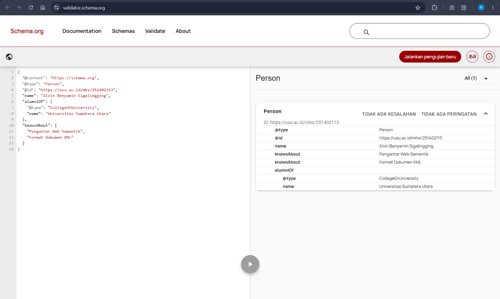
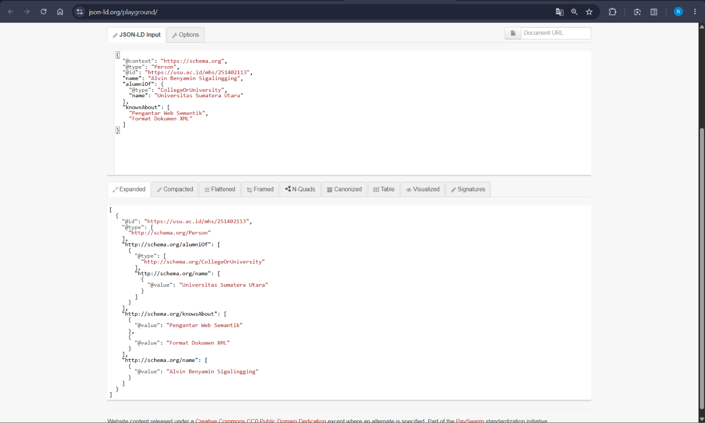
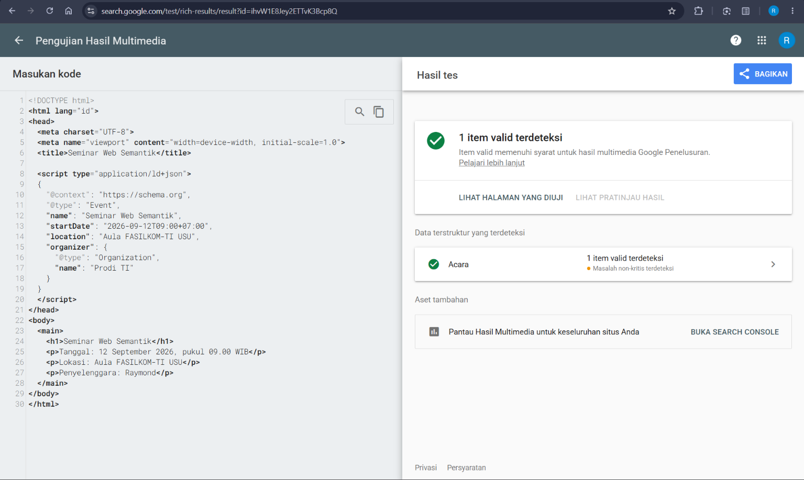

# Latihan Pertemuan 3 - JSON-LD dan Structured Data

## Identitas
- Nama: Ryan Fredryck Ginting
- NIM: 251402075

- Nama: Raymond Ganda Parsaoran Simarmata
- NIM: 251402078

- Nama: Charles
- NIM: 251402081

- Nama: Alvin Benyamin Sigalingging
- NIM: 251402113

- Nama: Ryan Dani Stepanus Girsang
- NIM: 251402140

## Struktur Hasil
- `profil_saya.jsonld`
- `profil_perbaikan.jsonld`
- `seminar.html`
- folder `screenshots`

## 1. JSON Biasa dan JSON-LD
1. Perbedaan fungsi kunci: ...
2. Fungsi `@context`, `@type`, dan `@id`: ...
3. Node tanpa `@id`: ...

## 2. Pemeriksaan schema.org
1. Mengapa tipe yang paling spesifik dan masih tepat sebaiknya dipilih?  
jawaban: 
    Agar data lebih jelas dan sesuai dengan jenis entitas yang dijelaskan, sehingga lebih mudah dipahami oleh mesin.
2. Mengapa nama properti mengikuti schema.org, sedangkan nilainya boleh berbahasa Indonesia?  
jawaban:
    Karena nama properti seperti name, alumniOf, dan knowsAbout harus mengikuti standar schema.org agar dapat dikenali mesin. Nilainya bebas menggunakan bahasa Indonesia sesuai isi data.
3. Apa manfaat array pada knowsAbout?  
jawaban:
    Array memungkinkan kita memasukkan dan menyimpan lebih dari satu topik yang diketahui atau dikuasai oleh seseorang.

## 3. Perbaikan Lima Kesalahan

| No. | Bagian Salah | Alasan | Perbaikan |
|---|---|---|---|
| 1 | `"@type": "person"` | Penulisan tipe `Person` pada Schema.org bersifat case-sensitive. | Ubah menjadi `"@type": "Person"` |
| 2 | `'name': "Rina Anggraini"` | JSON menggunakan tanda kutip ganda (`"`), seharusnya menggunakan tanda kutip tunggal (`'`). | Ubah menjadi `"name": "Rina Anggraini"` |
| 3 | `"birthDate": "12 September 2004"` | Format tanggal tidak menggunakan standar ISO 8601. | Ubah menjadi `"birthDate": "2004-09-12"` |
| 4 | `"nomorInduk": "221401001"` | `nomorInduk` bukan tipe yang terdaftar di Schema.org. | Menghapus `nomorInduk` |
| 5 | Koma di properti terakhir | JSON tidak boleh memiliki koma setelah properti terakhir. | Koma setelah `birthDate` dihapus |

## 4. Triple dari JSON-LD Playground
Tuliskan satu baris N-Quads yang terbentuk:

```text
<https://usu.ac.id/mhs/251402113> <http://schema.org/alumniOf> _:b0 .
```

## 5. Hasil Validasi
- Schema Markup Validator: Tipe Person terdeteksi, tidak ada kesalahan, dan tidak ada peringatan
- Rich Results Test: 1 item valid terdeteksi, Data terstruktur yang terdeteksi dengan 8 masalah nonkritis terdeteksi
- JSON-LD Playground: Triple sudah terbentuk dengan benar

## 6. Refleksi
1. Mengapa `@context` disebut jembatan menuju makna?
2. Apa perbedaan fungsi Schema Markup Validator dan Rich Results Test?
3. Mengapa isi JSON-LD harus sama dengan konten yang terlihat pada halaman?

## Bukti


