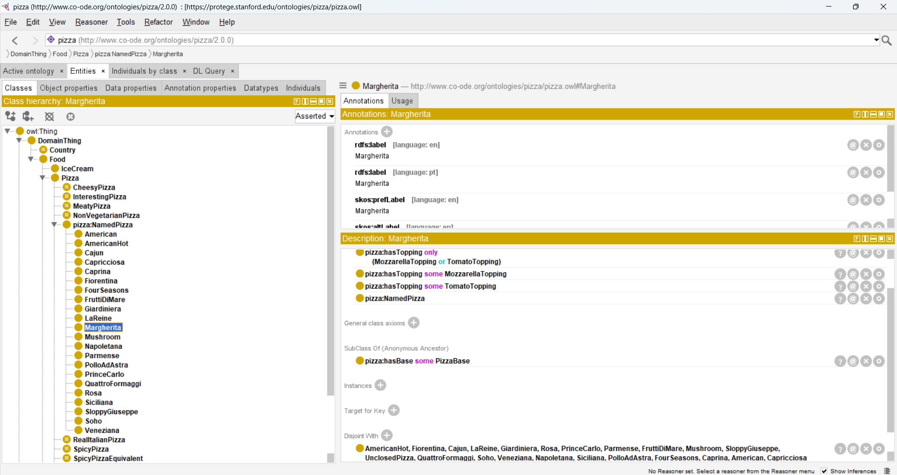

# Pertemuan 5 - Ontology dan Arsitektur Web Semantik

## Ontology mini kampus
- IRI dasar: https://kelas.usu.ac.id/ontology#
- Domain: Universitas Sumatera Utara

## Komponen ontology
| Komponen | Isi yang dibuat |
| --- | --- |
| Class | Person, Course, Department, Faculty, Room, Semester |
| Subclass | Student subClassOf Person, Lecturer subClassOf Person, UndergraduateStudent subClassOf Student |
| Object property | Teaches |
| Datatype property | hasCredit |
| Individual | mahasiswa_anda bertipe Student, dosen_anda bertipe Lecturer, matkul_ws bertipe Course |
| Axiom/disjointness | Student disjointWith Lecturer |

## Eksplorasi Protégé (pizza.owl)

Sumber: https://protege.stanford.edu/ontologies/pizza/pizza.owl
Screenshot class hierarchy: 

| Komponen | Contoh dari pizza.owl | Keterangan |
| --- | --- | --- |
| Class | `Pizza` | Konsep umum untuk semua jenis pizza |
| Subclass | `NamedPizza` subClassOf `Pizza`; `Margherita` subClassOf `NamedPizza` | Pizza dengan nama/resep tertentu |
| Individual | `Italy` bertipe `Country` | Instance konkret negara asal |
| Object property | `hasTopping` (domain `Pizza`, range `PizzaTopping`) | Menghubungkan pizza dengan topping-nya; sub-property dari `hasIngredient` |
| Datatype property | `hasCalorificContentValue` (domain `Food`, range `xsd:integer`) | Tidak ada di file bawaan, ditambahkan sendiri mengikuti tutorial Protégé |

### Catatan tentang domain dan open world
Property `hasTopping` memiliki domain `Pizza`. Ini tidak berarti reasoner akan
*menolak* data jika subjeknya bukan Pizza, seperti constraint pada database.
Justru reasoner akan *menyimpulkan* bahwa setiap subjek yang memakai `hasTopping`
adalah sebuah `Pizza`. OWL memakai asumsi open world: informasi yang tidak
dinyatakan dianggap belum diketahui, bukan dianggap salah.

## Layer Cake
Jelaskan posisi ontology dalam Semantic Web Layer Cake: [isi jawaban]

## Perbandingan serialisasi
- Turtle: menggunakan sintaks yang lebih ringkas dan menggunakan prefix untuk mempersingkat IRI. Struktur penulisannya lebih mudah dibaca.
- RDF/XML: menggunakan struktur XML dengan tag pembuka dan penutup serta atribut seperti `rdf:about` dan `rdf:resource`.
- Kesamaan makna: kedua format merepresentasikan ontology yang sama, sehingga class, property, individual, dan IRI tetap memiliki makna yang sama.

## Refleksi
1. Apa perbedaan ontology dan taksonomi?
2. Mengapa domain pada OWL bukan constraint database?
3. Mengapa kosakata yang sudah ada sebaiknya dipakai kembali sebelum membuat yang baru?
